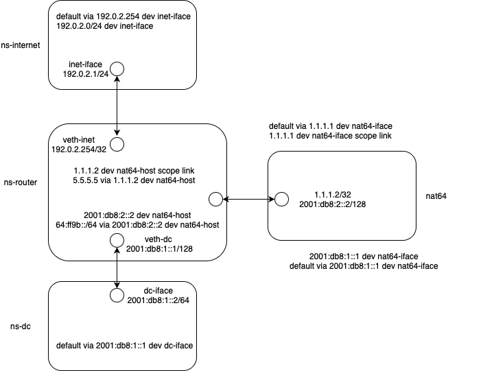

# Running the program with container image
A docker file is provided to build the program and run it in a container. You can build the container image or use the pre-build package. To run the container image, you first need to prepare a configuration file for the program. The configuration file is a text file with the following format:

```
addr_port_pool 5.5.5.5:10000-30000
north_interface internet-iface
south_interface intranet-iface
log_level error
```

The default path for the configuration file is `/etc/nat64_config.conf`. You can also specify the path to the configuration file by setting the `NAT64_CONF_FILE` environment variable when you start the container. Meanwhile, it is needed to mount the configuration file to the container when you start it.

## Naively running the program with container image
Natively running the nat64 container means that the container is given the permission to access host's network namespace. It is the simplest way to hook this program to the host's networking interfaces facing internet and intranet.

For example, you can run the following command to start the container:

```
sudo REGISTRY_AUTH_FILE=$HOME/.config/containers/auth.json podman run --rm --privileged -it --network host -v /sys/fs/bpf:/sys/fs/bpf  -v /sys/kernel/debug:/sys/kernel/debug -v /etc/nat64_config.conf:/etc/nat64_config.conf  ghcr.io/ironcore-dev/ebpf-nat64:sha-5ff61a0
```

or
```
sudo podman run --rm --privileged -it --network host -v /sys/fs/bpf:/sys/fs/bpf  -v /sys/kernel/debug:/sys/kernel/debug -v /etc/nat64_config.conf:/etc/nat64_config.conf  ghcr.io/ironcore-dev/ebpf-nat64:sha-5ff61a0
```

## Running the program with container image in a prepared network namespace
Of course, you can also run the program in a prepared network namespace. By using veth pairs and appropriate routes, you can minimize the impact of the program on the host's network namespace. For example, assuming that you have a namespace prepared and its name is `ns-router`, you can run the following command to start the container. Note that, since it is still a private project, you need to configure the registry authentication file to pull the container image.

```
sudo REGISTRY_AUTH_FILE=$HOME/.config/containers/auth.json podman run --rm --privileged -it  --network ns:/run/netns/ns-router -v /sys/fs/bpf:/sys/fs/bpf  -v /sys/kernel/debug:/sys/kernel/debug -v /etc/nat64_config.conf:/etc/nat64_config.conf  ghcr.io/ironcore-dev/ebpf-nat64:sha-5ff61a0
```


if you build the container image by yourself or once the container image is pushed to the public registry, you can use the following command to start the container:
```
sudo podman run --rm --privileged -it  --network ns:/run/netns/ns-router -v /sys/fs/bpf:/sys/fs/bpf  -v /sys/kernel/debug:/sys/kernel/debug -v /etc/nat64_config.conf:/etc/nat64_config.conf  ghcr.io/ironcore-dev/ebpf-nat64:sha-5ff61a0
```


## Single-node example
In this example, we will use a single node to demonstrate how to run the program with container image. Linux namespace and veth pairs are used to emulate interconnections between the IPv4 internet and the IPv6 intranet. In the end, the example demonstrates the following emulated network topology:




First, we need to prepare the network namespace and veth pairs, to emulate router, internet, and datacenter.

```
ip netns add ns-router

ip netns add ns-internet
ip link add inet-iface type veth peer name veth-inet
ip link set veth-inet netns ns-router
ip link set inet-iface netns ns-internet
ip netns exec ns-router ip link set veth-inet up
ip netns exec ns-internet ip link set inet-iface up

ip netns add ns-datacenter
ip link add dc-iface type veth peer name veth-dc
ip link set dc-iface netns ns-datacenter
ip link set veth-dc netns ns-router
ip netns exec ns-datacenter ip link set dc-iface up
ip netns exec ns-router ip link set veth-dc up


ip netns exec ns-internet ip addr add 192.0.2.1/24 dev inet-iface
ip netns exec ns-internet ip route add default via 192.0.2.254 dev  inet-iface

ip netns exec ns-datacenter ip addr add 2001:db8:1::2/64 dev dc-iface
ip netns exec ns-datacenter ip route add default via 2001:db8:1::1 dev dc-iface


ip netns exec ns-router ip addr add 192.0.2.254/24 dev veth-inet
ip netns exec ns-router ip addr add 2001:db8:1::1/64 dev veth-dc

ip netns exec ns-router sysctl -w net.ipv4.ip_forward=1
ip netns exec ns-router sysctl -w net.ipv6.conf.all.forwarding=1

ip netns exec ns-router ip r add 192.0.2.1 dev veth-inet
ip netns exec ns-router ip -6 r add 2001:db8:1::2 dev veth-dc
```

Then, we need to prepare the namespace and veth pairs so that Ipv6 traffic can be routed to the container holding the NAT64 program.
```
ip netns add nat64
ip link add nat64-iface type veth peer name nat64-host
ip link set nat64-iface netns nat64
ip link set nat64-host netns ns-router
ip netns exec ns-router ip link set nat64-host up
ip netns exec nat64 ip link set nat64-iface up

ip netns exec ns-router ip -6 addr add 2001:db8:1::1/128 dev nat64-host
ip netns exec ns-router ip addr add 1.1.1.1/32 dev nat64-host

ip netns exec nat64 ip addr add 1.1.1.2/32 dev nat64-iface
ip netns exec nat64 ip  -6 addr add 2001:db8:2::2/128 dev nat64-iface

ip netns exec ns-router ip r add 1.1.1.2 dev nat64-host
ip netns exec ns-router ip r add 5.5.5.5 via 1.1.1.2

ip netns exec ns-router ip -6 r add  2001:db8:2::2 dev nat64-host
ip netns exec ns-router ip -6 r add  64:ff9b::/64 via 2001:db8:2::2


ip netns exec nat64 ip r add 1.1.1.1 dev nat64-iface
ip netns exec nat64 ip r add default via 1.1.1.1

ip netns exec nat64 ip -6 r add 2001:db8:1::1 dev nat64-iface
ip netns exec nat64 ip -6 r add default via 2001:db8:1::1

ip netns exec nat64 sysctl -w net.ipv6.conf.all.forwarding=1
ip netns exec nat64 sysctl -w net.ipv4.ip_forward=1
```

Lastly, we need to prepare the configuration file (`/etc/nat64_config.conf`) for the NAT64 program.

```
addr-port-pool 5.5.5.5:3000-4000
south-interface nat64-iface
log-level error
```

Then, we can start the container.
```
sudo podman run --rm --privileged -it --pid=host --uts=host --ipc=host --network ns:/run/netns/nat64 -v /sys/fs/bpf:/sys/fs/bpf  -v /sys/kernel/debug:/sys/kernel/debug -v /etc/nat64_config.conf:/etc/nat64_config.conf  ghcr.io/ironcore-dev/ebpf-nat64:sha-5ff61a0
```

After the container is started, you can test the program by sending IPv6 traffic to the container and receiving the response from the container.

```
sudo ip netns exec ns-datacenter ping6 64:ff9b::c000:201
```


