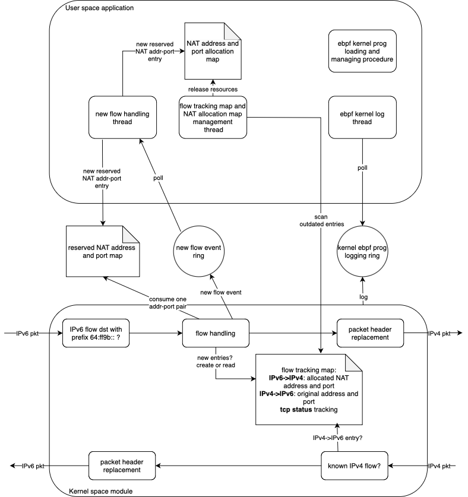
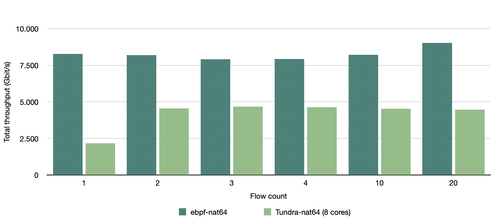

# System architecture
This ebpf NAT64 implementation contains two components: 1) an kernel module that implements the NAT64 functionality and handles outgoing IPv6 traffic that has destination addresses with prefix 64:ff9b::/96, and 2) an user space application that manages the eBPF program, and performs NAT64 shared IPv4 address and allocated port resources management. These two components share information via ebpf provided shared ring buffer and pinned maps. The detailed architecture is shown in the following figure.

What should be noted is that, in the current design, the kernel module do not perform routing. It only performs correpsonding header conversion between IPv4 and IPv6. The routing is performed by the Linux kernel.

# Performance
The performance of the current implementation is compared with the state-of-the-art implementation [Tundra-nat64](https://github.com/vitlabuda/tundra-nat64) in the following figure.

