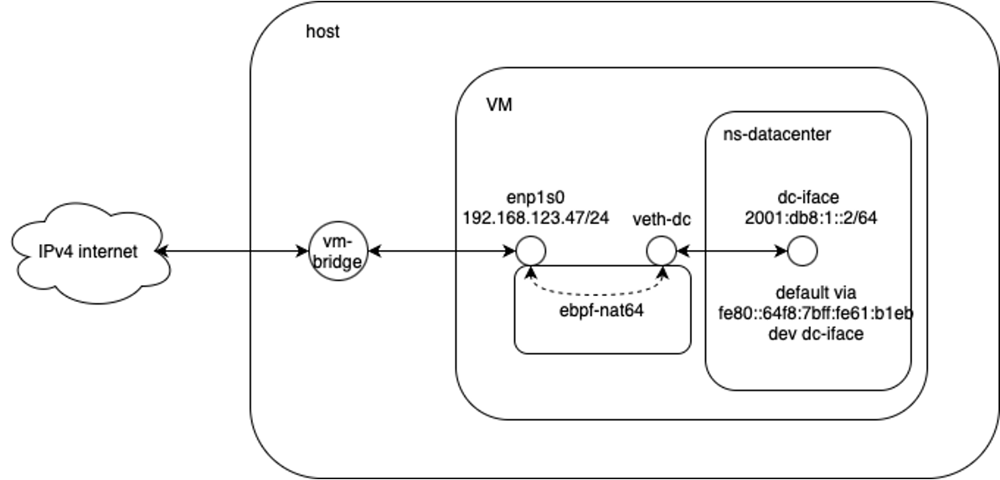

# Usage

## Dependency

- meson
- ninja
- bpftool
- clang
- libbpf-dev >= 1.3.0
- linux-headers
- [Go 1.23.1](https://go.dev/doc/install)

In order to compile and run the program, you need to install the dependencies by running:
```
sudo apt install meson ninja-build clang libbpf-dev linux-headers-$(uname -r) bpftool
```

On debian, `bpftool` is usually installed under `/usr/sbin/`, thus it may need to run `export PATH=$PATH:/usr/sbin'` so that this program is accessible.


## Compiling the program
After installing the dependencies, you can compile and run the program by running the following commands:
```
meson build
ninja -C build
```
It is going to generate a `build` directory containing the compiled program for both execution and testing.

## Running the program
The generated binary. `ebpf_nat64` supports several parameters:

| Parameter                | Values / Arguments                  | Description                                                                 |
|---------------------------|-------------------------------------|-----------------------------------------------------------------------------|
| `--log-level`             | `error`, `warning`, `info`, `debug` | Set the log level                                                           |
| `--addr-port-pool`        | `<addr:port-range>`                 | NAT address and port range                                                  |
| `--north-interface`       | `<iface1,iface2,...>`               | Interfaces facing IPv4 internet                                             |
| `--south-interface`       | `<iface1,iface2,...>`               | Interfaces facing IPv6 intranet                                             |
| `--icmp-icmp6-cksum-recalc` | *(flag)*                          | Enable ICMP/ICMP6 checksum recalculation in software                        |
| `--tcp-udp-cksum-recalc`  | *(flag)*                            | Enable TCP/UDP checksum recalculation in software                           |
| `--skb-mode`              | *(flag)*                            | Enable SKB mode                                                             |
| `--multi-page-mode`       | *(flag)*                            | Enable multi-page mode for jumbo frame interfaces                           |
| `--json-log`              | *(flag)*                            | Enable JSON formatted log messages                                          |
| `--test-mode`             | *(flag)*                            | Enable test mode for automated testing                                      |
| `--forwarding-mode`       | `0`, `1`, `2`                       | Forwarding mode: `0` = kernel (default), `1` = tx (same interface), `2` = redirect (different interface) |


To execute the program, you need to specify the address and port pool for the NAT64 prefix. You also need to specify the interfaces to run the program. Normally, the interfaces are the physical interfaces of the router that connect to the Internet and the private network. For example, if you want to attach the program to the interfaces `enp59s0f0np0` and `enp59s0f1np1`, and use the exposed IPv4 address 5.5.5.5 for the NAT64 address and the port range 10000-30000 for the translated ports, you can run the following command:
```
sudo ./build/src/ebpf_nat64 --addr-port-pool 5.5.5.5:10000-30000 --north-interface internet-iface --south-interface intranet-iface --log-level [error/warning/info/debug]
```

Alternatively, you can start the program without parameters, but instead, a configuration file can be provided using the `/etc/nat64_config.conf` path. This configuration file is a text file with the following format:
```
addr_port_pool 5.5.5.5:10000-30000
north_interface internet-iface
south_interface intranet-iface
log_level error
```

Additionally, if your interfaces are configured with jumbo frame, it is possible to load the program with the multi-page mode using the option `--multi-page-mode`. Otherwide, the error, `Peer MTU is too large to set XDP`, is going to appear.

Press `Ctrl-C` to terminate the program.

## Example: running ebpf-nat64 in VM
Running ebpf-nat64 in VM for both experimenting and deloyment purposes minimises the impact of configurations on the behaviors of the currrent machine or router. Thus, an example of running ebpf-nat64 in a VM to enable real communication for an IPv6-only interface is provided here as a reference.



The above figure depicts the setup for this demo of running ebpf-nat64 inside a VM. The assumption is that there is a running VM with internet connection via the ethernet interface communicating with the outside world by connecting to the standard hypervisor bridge. In this example, the VM automaticaly obtains the IP address of `192.168.123.47/24`, and please ensure the VM has internet connection by running, e.g., `sudo apt update`.

The next step is to create a IPv6-only stack in a namespace to emulate the IPv6 network. To achieve this, inside the VM, run the commands below.

```
ip netns add ns-datacenter
ip link add dc-iface type veth peer name veth-dc
ip link set dc-iface netns ns-datacenter

ip netns exec ns-datacenter ip link set dc-iface up
ip link set veth-dc up

ip netns exec ns-datacenter ip addr add 2001:db8:1::2/64 dev dc-iface
ip netns exec ns-datacenter ip route add default via fe80::64f8:7bff:fe61:b1eb dev dc-iface //use the link-local address of veth-dc
ip netns exec ns-datacenter ethtool -K dc-iface tx off

ip -6 r add 2001:db8:1::2 dev veth-dc


sysctl -w net.ipv4.ip_forward=1
sysctl -w net.ipv6.conf.all.forwarding=1
```

It is possible to compile ebpf-nat64 directly in the VM or copy the compiled binary into the VM with necessary package installation. After that, running the command to start it:

```
./build/src/ebpf_nat64 --addr-port-pool 192.168.123.47:15000-25000 --south-interface veth-dc --north-interface enp1s0 --log-level debug --forwarding-mode redirect --tcp --icmp
```

Inside the namespace of `ns-datacenter`, running `wget http://[64:ff9b::5a1:7c3]:80/100MB.bin` should allow downloading this file from an actual file server on the internet.


# Prometheus exporter
A prometheus exporter is provided to help users to get insight regarding the operation status of this program. To use this prometheus exporter, after sucessful compilation of the project, simply run `sudo ./build/exporter/exporter` to start collection of metrics from the eBPF kernel module, and run `curl -s http://192.168.23.86:2112/metrics` to query statistics. It should be noted that, the `exporter` program is supposed to run in the same linux namespace as the NAT64 program, either in the host's namespace or a container's namespace.


# Code testing
The code testing is based on the capability of trigging execution of the kernel program without actually attaching it to any network interface. This API is provided by the `bpf_prog_test_run_opts` in the `libbpf` [library](https://libbpf.readthedocs.io/en/latest/api.html).

Run the following command to test the code after compilation:
```
sudo ./build/src/ebpf_nat64_test --addr-port-pool 192.168.9.1:100-120 --log-level error
```
