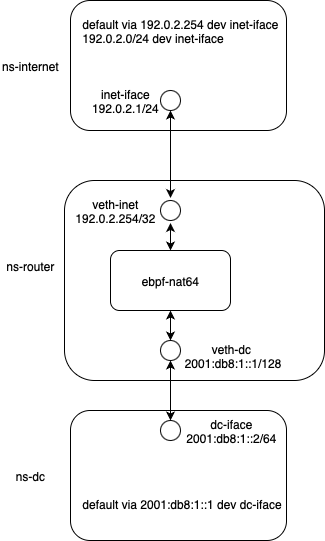

# Usage

## Dependency

- meson
- ninja
- bpftool
- clang
- libbpf-dev >= 1.3.0
- linux-headers
- [Go 1.23.1](https://go.dev/doc/install)

In order to compile and run the program, you need to install the dependencies by running:
```
sudo apt install meson ninja-build clang libbpf-dev linux-headers-$(uname -r) bpftool
```

On Debian, `bpftool` is usually installed under `/usr/sbin/`, so you may need to run `export PATH=$PATH:/usr/sbin` to make this program accessible.


## Compiling the program
After installing the dependencies, you can compile and run the program by running the following commands:
```
meson build
ninja -C build
```
It is going to generate a `build` directory containing the compiled program for both execution and testing.

## Running the program
The generated binary `ebpf_nat64` supports several parameters:

| Parameter                | Values / Arguments                  | Description                                                                 |
|---------------------------|-------------------------------------|-----------------------------------------------------------------------------|
| `--log-level`             | `error`, `warning`, `info`, `debug` | Set the log level                                                           |
| `--addr-port-pool`        | `<addr:port-range>`                 | NAT address and port range                                                  |
| `--north-interface`       | `<iface1,iface2,...>`               | Interfaces facing IPv4 internet                                             |
| `--south-interface`       | `<iface1,iface2,...>`               | Interfaces facing IPv6 intranet                                             |
| `--icmp-icmp6-cksum-recalc` | *(flag)*                          | Enable ICMP/ICMP6 checksum recalculation in software                        |
| `--tcp-udp-cksum-recalc`  | *(flag)*                            | Enable TCP/UDP checksum recalculation in software                           |
| `--skb-mode`              | *(flag)*                            | Enable SKB mode                                                             |
| `--multi-page-mode`       | *(flag)*                            | Enable multi-page mode for jumbo frame interfaces                           |
| `--json-log`              | *(flag)*                            | Enable JSON formatted log messages                                          |
| `--test-mode`             | *(flag)*                            | Enable test mode for automated testing                                      |
| `--forwarding-mode`       | `0`, `1`, `2`                       | Forwarding mode: `0` = kernel (default), `1` = tx (same interface), `2` = redirect (different interface) |


To execute the program, you need to specify the address and port pool for the NAT64 prefix. You also need to specify the interfaces to run the program. Normally, the interfaces are the physical interfaces of the router that connect to the Internet and the private network. For example, if you want to attach the program to the interfaces `enp59s0f0np0` and `enp59s0f1np1`, and use the exposed IPv4 address 5.5.5.5 for the NAT64 address and the port range 10000-30000 for the translated ports, you can run the following command:
```
sudo ./build/src/ebpf_nat64 --addr-port-pool 5.5.5.5:10000-30000 --north-interface internet-iface --south-interface intranet-iface --log-level [error/warning/info/debug]
```

Alternatively, you can start the program without parameters, but instead, a configuration file can be provided using the `/etc/nat64_config.conf` path. This configuration file is a text file with the following format:
```
addr_port_pool 5.5.5.5:10000-30000
north_interface internet-iface
south_interface intranet-iface
log_level error
```

Additionally, if your interfaces are configured with jumbo frames, you can load the program with multi-page mode using the option `--multi-page-mode`. Otherwise, the error `Peer MTU is too large to set XDP` will appear.

Press `Ctrl-C` to terminate the program.


# Example: running ebpf-nat64 directly on a router
Running ebpf-nat64 directly on an emulated router is the easiest way to experiment with its functionality. Therefore, an example of running ebpf-nat64 in an emulated environment using Linux namespaces is provided.



The above figure depicts the setup for this demo of running ebpf-nat64 inside a VM. First, we need to prepare the network namespace and veth pairs, to emulate router, internet, and datacenter.

```
ip netns add ns-router

ip netns add ns-internet
ip link add inet-iface type veth peer name veth-inet
ip link set veth-inet netns ns-router
ip link set inet-iface netns ns-internet
ip netns exec ns-router ip link set veth-inet up
ip netns exec ns-internet ip link set inet-iface up

ip netns add ns-datacenter
ip link add dc-iface type veth peer name veth-dc
ip link set dc-iface netns ns-datacenter
ip link set veth-dc netns ns-router
ip netns exec ns-datacenter ip link set dc-iface up
ip netns exec ns-router ip link set veth-dc up


ip netns exec ns-internet ip addr add 192.0.2.1/24 dev inet-iface
ip netns exec ns-internet ip route add default via 192.0.2.254 dev  inet-iface

ip netns exec ns-datacenter ip addr add 2001:db8:1::2/64 dev dc-iface
ip netns exec ns-datacenter ip route add default via 2001:db8:1::1 dev dc-iface


ip netns exec ns-router ip addr add 192.0.2.254/24 dev veth-inet
ip netns exec ns-router ip addr add 2001:db8:1::1/64 dev veth-dc

ip netns exec ns-router sysctl -w net.ipv4.ip_forward=1
ip netns exec ns-router sysctl -w net.ipv6.conf.all.forwarding=1

ip netns exec ns-router ip r add 192.0.2.1 dev veth-inet
ip netns exec ns-router ip -6 r add 2001:db8:1::2 dev veth-dc

ip netns exec ns-datacenter ethtool -K dc-iface tx off
ip netns exec ns-internet ethtool -K inet-iface tx off

ip netns exec ns-router ping -c 3 192.0.2.1
ip netns exec ns-router ping6 -c 3 2001:db8:1::2
```

One tricky point is that, due to the driver limitations of the veth device type, to make the XDP `redirect` action work, you need to load a dummy eBPF program onto the veth device on the opposite side. The dummy eBPF program used in this document is from the [ebpf-playground](https://github.com/byteocean/ebpf-playground) project. Compile this project and load it onto the interfaces in the namespaces `ns-internet` and `ns-datacenter` separately.

```
sudo ip netns exec ns-internet ./ebpf-playground/build/src/playground inet-iface
sudo ip netns exec ns-datacenter ./ebpf-playground/build/src/playground dc-iface
```

Another tricky point is that you have to enter the `ns-router` namespace (`sudo ip netns exec ns-router bash`) and execute `mount bpffs /sys/fs/bpf -t bpf`.

The next step is to start ebpf-nat64 in the router namespace (ns-router) by running:

```
./build/src/ebpf_nat64 --addr-port-pool 5.5.5.5:15000-25000 --south-interface veth-dc --north-interface veth-inet --log-level error --forwarding-mode redirect  --tcp --icmp
```

Once it gets started, you can test the program by sending IPv6 traffic.

```
sudo ip netns exec ns-datacenter ping6 64:ff9b::c000:201
```

## Example: running ebpf-nat64 in VM
Running ebpf-nat64 in a VM for both experimenting and deployment purposes minimizes the impact of configurations on the behavior of the current machine or router. Therefore, an example of running ebpf-nat64 in a VM to enable real communication for an IPv6-only interface is provided here as a reference.


The above figure depicts the setup for this demo of running ebpf-nat64 inside a VM. The assumption is that there is a running VM with an internet connection via the ethernet interface communicating with the outside world by connecting to the standard hypervisor bridge. In this example, the VM automatically obtains the IP address `192.168.123.47/24`. Please ensure the VM has an internet connection by running, e.g., `sudo apt update`.

The next step is to create an IPv6-only stack in a namespace to emulate the IPv6 network. To achieve this, inside the VM, run the commands below.

```
ip netns add ns-datacenter
ip link add dc-iface type veth peer name veth-dc
ip link set dc-iface netns ns-datacenter

ip netns exec ns-datacenter ip link set dc-iface up
ip link set veth-dc up

ip netns exec ns-datacenter ip addr add 2001:db8:1::2/64 dev dc-iface
ip netns exec ns-datacenter ip route add default via fe80::64f8:7bff:fe61:b1eb dev dc-iface  # use the link-local address of veth-dc
ip netns exec ns-datacenter ethtool -K dc-iface tx off

ip -6 r add 2001:db8:1::2 dev veth-dc


sysctl -w net.ipv4.ip_forward=1
sysctl -w net.ipv6.conf.all.forwarding=1
```

You can compile ebpf-nat64 directly in the VM or copy the compiled binary into the VM with the necessary package installation. After that, run the following command to start it:

```
./build/src/ebpf_nat64 --addr-port-pool 192.168.123.47:15000-25000 --south-interface veth-dc --north-interface enp1s0 --log-level debug --forwarding-mode redirect --tcp --icmp
```

Inside the `ns-datacenter` namespace, running `wget http://[64:ff9b::5a1:7c3]:80/100MB.bin` should allow you to download this file from an actual file server on the internet.


# Prometheus exporter
A Prometheus exporter is provided to help users gain insight into the operation status of this program. To use this Prometheus exporter, after successful compilation of the project, simply run `sudo ./build/exporter/exporter` to start collecting metrics from the eBPF kernel module, and run `curl -s http://192.168.23.86:2112/metrics` to query statistics. Note that the `exporter` program should run in the same Linux namespace as the NAT64 program, either in the host's namespace or a container's namespace.


# Code testing
The code testing is based on the capability of triggering execution of the kernel program without actually attaching it to any network interface. This API is provided by `bpf_prog_test_run_opts` in the `libbpf` [library](https://libbpf.readthedocs.io/en/latest/api.html).

Run the following command to test the code after compilation:
```
sudo ./build/src/ebpf_nat64_test --addr-port-pool 192.168.9.1:100-120 --log-level error
```
